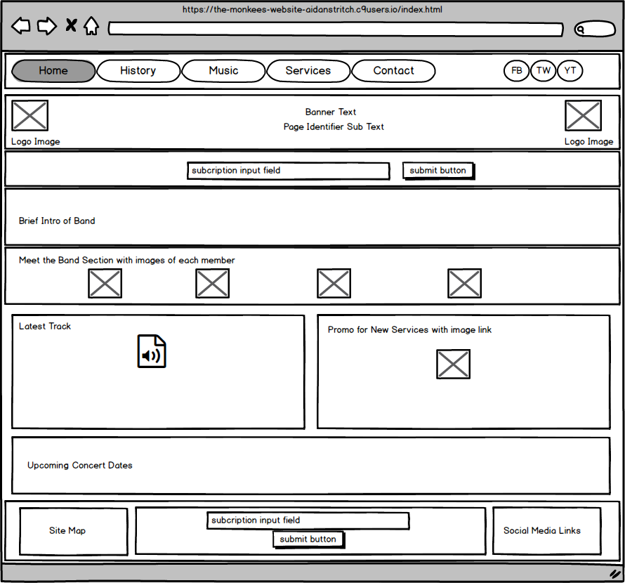
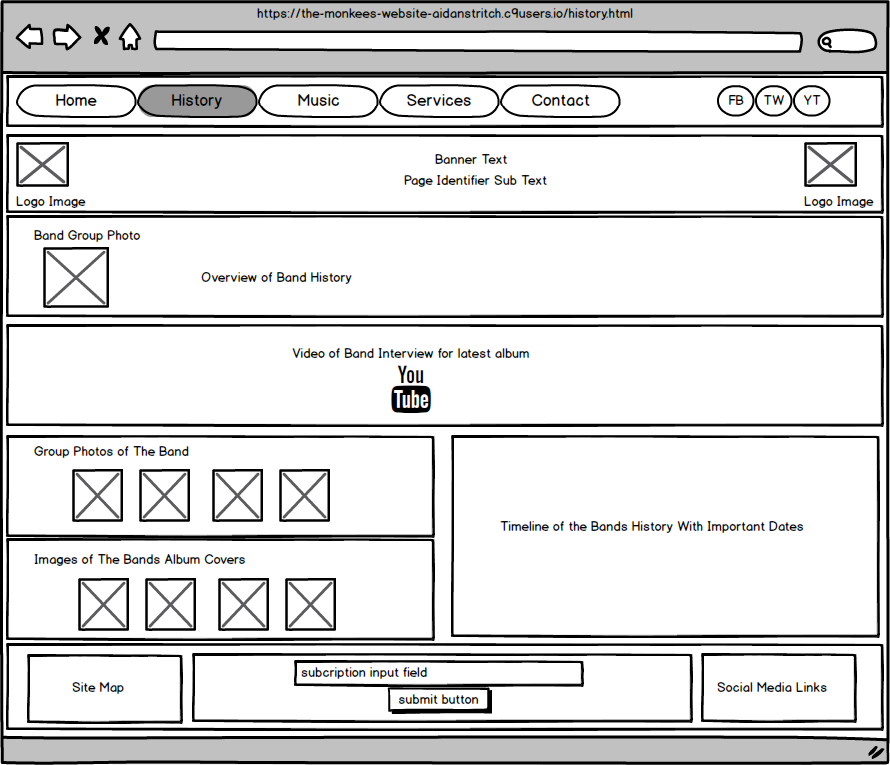

# The Monkees Website
This project is to create a new website solution for the band "The Monkees" 
which would showcase their new content for potential new fans, while also 
appealing to existing fans wanting to find out more about their favourite band.

The band has always had a 60's theme with their colours and style, which was 
incorporated into the design of this website. 

The band also requested that we enure that the social media was showcased as 
they are trying to create a strong social media brand awareness. 

## UX
This project was designed to fulfil several criteria as set out by the band. 
This included;

1. Balance the content between the two target audiences; new and existing fans
2. Showcase their music, images, and video clips
3. Promote their new services; weddings and christmas parties
4. Promote and help grow their social media

This website balances these goals perfectly as the content was designed to give 
a basic overview of the band, so as to not alienate new or existing fans or 
overload them with content. For newer fans, and devoted existing fans, we have 
included a timeline of the bands greatest achievements. To help newer fans identify
with the band, we have included a "meet the band" section on the home page with 
images of the band members. 

To help promote their new single, we have included this on the home page, as well 
as in the music page. The History page includes images of the band together, the 
previously mentioned timeline, and also a clip from the Monkees official YouTube 
channel with an interview with the band about their upcoming album. In the music 
section, we have included several of their top hits, which can be played directly
from the site and also YouTube videos of the band playing live.

To promote their new services, we have included a promo section on the home page 
as well as a full page of the site with details of these offerings. 

We have also included links to their social media in the nav bar and footer, so
that new and existing fans will see clearly that the band has these services and 
can click on them to link directly to these channels and follow the bands progress 
on all of their social media.

### User Stories
#### New Potential Fans
- As a website visitor and potential fan, I want to have access to multimedia content, 
so I can play it while I am visiting the website to see if I like the band
- As a website visitor and potential fan, I want to have access to upcoming gigs and 
concerts, so I can follow every single step of the band and maybe see them live
- As a website visitor and potential fan, I want to be able to subscribe to a 
mailing list, so I can get personalised content about the band
- As a website visitor and potential fan, I want to contact the band and check 
pricing, so I can arrange a gig for any personal occasion 
- As a website visitor and potential fan, I want to get access to the band social 
media, so I can follow them closer across social networks

#### Existing Fans
- As an existing fan, I would like to find out more about The Monkees history so
that I can get to know them better
- As an existing fan, I would like to find out if The Monkees have any upcoming 
concerts near me so that I can see them live
- As an existing fan, I would like to follow them on social media so that I can 
keep up to date with their latest news
- As an existing fan, I would like to contact them to see if they will be able to
play at my companies upcoming christmas party
- As an existing fan, I would like to listen to their latest tracks and download 
them so that I can listen to them on the go

### Site Maps
#### Desktop

#### Mobile

## Features

### Existing Features
1. The mailing list signup form - allows users to sign up to the Monkees mailing
list by typing in their email address and clicking on "subscribe" button
2. The audio media players - allow users to listen to the Monkees tracks and to
download the songs by clicking on the audo player menu and choosing "download"
3. The embedded videos and hosted video - allow users to watch the band playing 
the music as well as listen by clicking the play button
4. The site map - allows users to navigate the website from the footer if they get
lost by clicking on the relavent page link
5. Social media links - allow the user to go to an external social media channel 
so that they can view more up to date information and follow the band for the 
latest news by simply clicking on the icon 
6. The history.html timeline - allows the users to see key moments in the bands 
history by simply scrolling down and reading the points
7. The "see us live" section on index.html - allows users to see upcoming concerts
by checking the locations and dates to see when the Monkees will be playing near 
them
8. The contact us form - allows users to contact the band directly and choose 
which areas they are interested in by clicking on the corresponding radio button
by simply filling in the fields and clicking on the "submit" button

### Features Left To Be Implemented
1. Link to the spotify page when its created
2. Interactive world map of upcoming concerts
3. Ticket sales section for upcoming concerts
4. Merchandise page with online store
5. Blog section with articles from the band relating to past triumphs and upcoming
news

## Technologies Used
- HTML - this site uses HTML to instruct the browser how to interprit the code correctly and arrange the layout
- CSS - this site uses CSS to aid in the style, and overall theme of the website
- Bootstrap - this site uses Bootstrap elements to help design the framework of the site
- Balsamiq - this was used to create the wireframes in the design phase 

## Testing
1. Audio Files
- click on the play button and verify that the song plays
- click on the pause button and verify that the song pauses
- click on the menu link and download and verify that the song downloads correctly
- click on the progress bar to change the timing position of the song and verify 
that the song plays correctly
- mute the volume and verify that the volume mutes
- change the volume to lowest setting and verify that the song cannot be heard

2. Videos
- click on the play button and verify that the video plays
- click on the pause button and verify that the video pauses
- click on the menu link and download and verify that the video downloads correctly
- click on the progress bar to change the timing position of the video and verify 
that the video plays correctly
- mute the volume and verify that the volume mutes
- change the volume to lowest setting and verify that the video cannot be heard
- make the video full screen and then back to regular size and verify that there 
are no issues

3. Contact Form
- try to submit with all fields blank and verify that an error message regarding 
the required fields is shown
- fill in all fields, but have name field blank and submit and verify that an 
error message regarding the required fields is shown
- fill in all fields, but have email address field blank and submit and verify 
that an error message regarding the required fields is shown
- fill in all fields, but have email address field without "@" symbol and submit 
and verify that an error message regarding the required fields is shown
- fill in all fields, have email address field with "@" symbol but without ".com" 
and submit and verify that an error message regarding the required fields is shown
- fill in all fields correctly, but change radio button selection to "other" and 
submit and verify the form is successful
- fill in all fields, but have "give us some specific details" field blank and 
submit and verify that an error message regarding the required fields is shown

4. Social Media
- click on Facebook icon in NAVBAR and verify that the correct page opens in a new tab
- click on Twitter icon in NAVBAR and verify that the correct page opens in a new tab
- click on YouTube icon in NAVBAR and verify that the correct page opens in a new tab
- click on Facebook icon in Footer and verify that the correct page opens in a new tab
- click on Twitter icon in Footer and verify that the correct page opens in a new tab
- click on YouTube icon in Footer and verify that the correct page opens in a new tab

5. Mailing List
- In header mailing list form - leave email address field blank and click 
"subscribe" and verify that an error message regarding the required fields is shown
- In header mailing list form - enter email address, but without "@" symbol and 
click "subscribe" and verify that an error message regarding the required fields 
is shown
- In header mailing list form - enter email address with "@" symbol but without 
".com" and click "subscribe" and verify that an error message regarding the 
required fields is shown
- In header mailing list form - enter all details correctly and verify that the 
form submits with no error messages 

- In footer mailing list form - leave email address field blank and click 
"subscribe" and verify that an error message regarding the required fields is shown
- In footer mailing list form - enter email address, but without "@" symbol and 
click "subscribe" and verify that an error message regarding 
the required fields is shown
- In footer mailing list form - enter email address with "@" symbol but without 
".com" and click "subscribe" and verify that an error message regarding the 
required fields is shown
- In footer mailing list form - enter all details correctly and verify that the 
form submits with no error messages

6. Responsiveness
- view site on "Galaxy S5" sizeand verify that there are no viewing issues
- view site on "iPad" sizeand verify that there are no viewing issues
- view site on "iPad Pro" sizeand verify that there are no viewing issues
- view site on "iPhone 5/SE" size and verify that there are no viewing issues
- view site on "desktop" and verify that there are no viewing issues

7. Page Links
- on index.html - click on services image and verify that it brings you to 
services page
- on services.html - click on image for "weddings" and verify it brings you to 
services page
- on services.html - click on image for "christmas parties" and verify it brings you to 
services page
- on services.html - click on the link for more information for "weddings" and verify it brings you to 
contact page
- on services.html - click on the link for more information for "christmas parties" and verify it brings you to 
contact page
- click on the home link in the footer site map and verify that it brings you to the home page

## Deployment

## Credits

### Content 

### Media

### Acknowledgments
